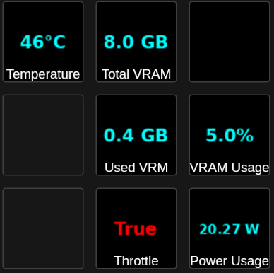

# NVIDIA GPU Usage OpenDeck Plugin

Display GPU metrics, such as temperature, VRAM (used, total, percentage), temperature, usage, power usage, and throttle state.

## Libraries
Uses BarRaider's [EasyPI v2](https://github.com/BarRaider/streamdeck-easypi-v2) to manage the settings, [nvidia-ml-py](https://pypi.org/project/nvidia-ml-py/) to get GPU metrics, and [Pillow](https://github.com/python-pillow/Pillow) to display the results.

## Installing
Make sure you have [OpenDeck](https://github.com/nekename/OpenDeck) installed. Go to Plugins, then "Install from file" and select the ZIP file that you created/downloaded from here.

## Building
If you want to build the plugin yourself, you can run the `build.sh` script. It basically just packages the Python scripts and resources into a ZIP file in a format that OpenDeck expects. You will also need my [base plugin](https://github.com/adamculbertson/opendeck-base-plugin) in the same directory as this plugin's directory.

## More Information
Information about the default included libraries, fonts, etc. can be found in my [base plugin](https://github.com/adamculbertson/opendeck-base-plugin)

### A note on throttle state...
In the screenshot, you see it states the GPU is throttled. If the GPU is in a lower power state (like P8 mode, which is basically idle mode), then it will indicate throttled here. There were no games running or anything to take advantage of the GPU.